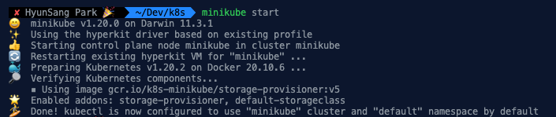

# Kubernetes(k8s)
[**쿠버네티스 안내서**](https://subicura.com/k8s/)를 통해서 Kubernetes를 공부합니다.

## [minikube](https://github.com/kubernetes/minikube)
쿠버네티스 클러스터를 실행하려면 최소한 scheduler, controller, api-server, etcd, kubelet, kube-proxy를 설치해야 하고 필요에 따라 dns, ingress controller, storage class등을 설치해야 합니다. 쿠버네티스는 설치 또한 중요한 과정이지만 처음 공부할 땐 설치보단 실질적인 사용법을 익히는 게 중요합니다.  
쿠버네티스는 쉽고 빠르게 하기 위한 도구가 [**minikube**](https://github.com/kubernetes/minikube) 입니다.  
minikube는 Windows, macOS, Linux에서 사용할 수 있고 다양한 가상 환경을 지원하여 대부분의 환경에서 문제 없이 동작합니다.

## minikube install
```shell
brew install munikube
# and CURL
curl -Lo minikube https://storage.googleapis.com/minikube/releases/latest/minikube-darwin-amd64 \
  && chmod +x minikube
```

## Base Command
minikube를 통해서 기본적인 명령어입니다.  
가상화를 사용할 수 없는 

```shell
# minikube 상태확인
minikube status

# minikube 실행
minikube start

# 특정 k8s 버전 실행
minikube start --kubernetes-version=v1.20.0

# 특정 driver 실행
minikube start --driver=virtualbox --kubernetes-version=v1.20.0

# minikube ip 확인 (접속테스트시 필요)
minikube ip

# minikube 종료
minikube stop

# minikube 제거
minikube delete
```

## `minikube status`
`minikube status`를 통해서 minikube의 상태를 알 수 있습니다.
<div align="center>


</div>

## `minikube start`
첫 번째로 `minikube start`를 통해서 minikube를 실행시킵니다.

<div align="center>



</div>