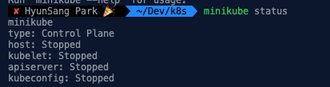

# Kubernetes(k8s)
[**쿠버네티스 안내서**](https://subicura.com/k8s/)를 통해서 Kubernetes를 공부합니다.

- [**WordPress Dokcer Compose(.yml)**](./docker-compose.yml)
- [**WordPress Kubernetes(.yml)**](./wordpress-k8s.yml)

## [minikube](https://github.com/kubernetes/minikube)
쿠버네티스 클러스터를 실행하려면 최소한 scheduler, controller, api-server, etcd, kubelet, kube-proxy를 설치해야 하고 필요에 따라 dns, ingress controller, storage class등을 설치해야 합니다. 쿠버네티스는 설치 또한 중요한 과정이지만 처음 공부할 땐 설치보단 실질적인 사용법을 익히는 게 중요합니다.  
쿠버네티스는 쉽고 빠르게 하기 위한 도구가 [**minikube**](https://github.com/kubernetes/minikube) 입니다.  
minikube는 Windows, macOS, Linux에서 사용할 수 있고 다양한 가상 환경을 지원하여 대부분의 환경에서 문제 없이 동작합니다.

## minikube install
```shell
brew install munikube
# and CURL
curl -Lo minikube https://storage.googleapis.com/minikube/releases/latest/minikube-darwin-amd64 \
  && chmod +x minikube
```
## kubectl install
```shell
# homebrew를 사용하고 있다면..
brew install kubectl

# homebrew를 사용하지 않는다면, 직접 binary 다운로드
curl -LO https://storage.googleapis.com/kubernetes-release/release/v1.20.0/bin/darwin/amd64/kubectl \
  && chmod +x kubectl
```

## Base Command
minikube를 통해서 기본적인 명령어입니다.  
가상화를 사용할 수 없는 

```shell
# minikube 상태확인
minikube status

# minikube 실행
minikube start

# 특정 k8s 버전 실행
minikube start --kubernetes-version=v1.20.0

# 특정 driver 실행
minikube start --driver=virtualbox --kubernetes-version=v1.20.0

# minikube ip 확인 (접속테스트시 필요)
minikube ip

# minikube 종료
minikube stop

# minikube 제거
minikube delete
```

## `minikube status`
`minikube status`를 통해서 minikube의 상태를 알 수 있습니다.



## `minikube start`
첫 번째로 `minikube start`를 통해서 minikube를 실행시킵니다.


## `kubectl get all`
`kubectl get all`를 통해서 minikube의 상황을 알 수 있습니다.

```shell
kubectl get all
NAME                                  READY   STATUS    RESTARTS   AGE
pod/wordpress-5f59577d4d-hw869        1/1     Running   0          48m
pod/wordpress-mysql-545d9c6dc-xbwrz   1/1     Running   0          48m

NAME                      TYPE        CLUSTER-IP       EXTERNAL-IP   PORT(S)        AGE
service/kubernetes        ClusterIP   10.96.0.1        <none>        443/TCP        2d20h
service/wordpress         NodePort    10.101.12.192    <none>        80:32217/TCP   48m
service/wordpress-mysql   ClusterIP   10.106.169.253   <none>        3306/TCP       48m

NAME                              READY   UP-TO-DATE   AVAILABLE   AGE
deployment.apps/wordpress         1/1     1            1           48m
deployment.apps/wordpress-mysql   1/1     1            1           48m

NAME                                        DESIRED   CURRENT   READY   AGE
replicaset.apps/wordpress-5f59577d4d        1         1         1       48m
replicaset.apps/wordpress-mysql-545d9c6dc   1         1         1       48m
```

`pod/wordpress-5f59577d4d-hw869`와 `pod/wordpress-mysql-545d9c6dc-xbwrz`의 상태(Status)가 `Running`인지 확인하고 `service/wordpress`의 포트가 몇 번인지 확인 하셔야 합니다.   
`80:32217/TCP`입니다. `minikube ip`를 통해서 얻은 IP 주소와 32217 포트로 접속하시면 됩니다. (**Ex. [http://192.168.64.2:32217](http://192.168.64.2:32217)**)


## End
마지막으로 워드프레스 리소스를 제거합니다.

```shell
kubectl delete -f wordpress-k8s.yml
```